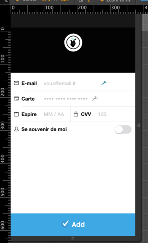

# Clac des Doigts (21/03/2016, Anas)

Le but de cet assistant est de livrer tout et n'importequoi à ses utilisateurs.

## TEST

### OB

L'inscription se fait sur la [HP de Clac des Doigts](https://clacdesdoigts.com).

Après avoir renseigné mon numéro de téléphone, j'ai reçu un premier texto. Si 
je renseigne ce numéro une deuxième fois, je reçois à nouveau le même SMS.

```
Pour que la magie commence, rien de plus simple ;-) 

  1/Inscrivez-vous sur [ClacdesDoigts.com/inscription](ClacdesDoigts.com/inscription)

  2/Commandez par sms au 0644609990

  - CLAC DES DOIGTS -

```

Je ne suis donc pas encore inscrit. Au fait : Pourquoi préciser le numéro en `2/` ?
Je clique donc sur le lien en question (cf.`1/`). Ça me redirige vers une page
contenant une description du service.

>Bienvenue sur Clac des Doigts, un service qui vous permet de vous faire livrer en moins d'une heure ou de commander un service en envoyant un simple SMS.
>Créez votre compte en 3 minutes. L'inscription est gratuite et les SMS ne sont pas surtaxés.

Mis à part la formulation "commander un service", tout me semble clair. En 
dessous, il y a un formulaire de créatiuon de compte : 
 - Nom, prénom : S'en sert pour la conversation,
 - Email : Pas sûr pourquoi, mais c'est obligatoire,
 - Numero de telephone : Identifiant unique, il faut le renseigner (même s'ils 
   m'ont contacté au-dit numéro)
 - Mot de passe : Sûrement pour pouvoir editer ces infos, à tester plus tard
 - Adresse : Dans le doute, je renseigne le Wok.
 - Date de naissance : Sûrement pour la livraison d'alcool,
 - [CGV](https://clacdesdoigts.com/a-propos) : Flême de lire. Je verrai plus tard.
 - Coordonnées bancaire : Géré par Stripe, avec une checkbox "remember me"

 

Je renseigne tout ça, et on enchaîne.

### ENGAGEMENT

#### Livraison de Fleurs 🌹

Je vais essayer de livrer des fleurs à ma copine, qui est actuellement dans mon
appartement. Voici l'extrait de conversation lié à cette demande.

```
A (10:52) : Je veux faire livrer un bouquet de roses

C (10:53) : Pouvez-vous me donner l'adresse de livraison svp ainsi que votre budget ? :)

A (10:54) : *** rue de Vaugirard 2ème gauche gauche , 20€
1
C (10:56) : Nous pouvons nous occuper de la commande pour 30 Euros  (avec un bouquet de 10 belles roses rouges) avec une livraison prévue en moins de 50 Minutes, répondez CLAC pour valider

A (10:56) : CLAC

A (10:56) : Digicode 6702

C (10:57) : Votre commande est validée. Merci de votre confiance ! Pouvez-vous me donner toutes informations nécessaires à la livraison (nom, étage, interphone etc) svp?

A (11:02) : Anas Arifi, 2eme étage gauche gauche , interphone 6702

C (11:03) : Merci c'est noté ! Notre génie runner est en route ;)

A (11:03) : Merci

A (11:04) : Les roses sont pour ´Kirstin'. Elle ouvrira la porte

C (11:05) : C'est noté Anas ;)

C (11:22) : Les fleurs viennent d'être livrées ;)

```

Avec **1mn de temps de réponse** et **livré en ± 20mn**, c'est costaud. Voyons
voir si c'est aussi rapide sur une 2eme commande. 

#### Livraison de bière 🍺

Ce soir, c'est l'aperal ! Je demande donc un pack de douze: 

```
A : Je peux avoir un pack de 12 leffes ?

C : Il faudra  compter 32 euros en moins de 45 minutes. Pouvez vous me donner 
    l’adresse de livraison svp.

A : C’est l’adresse à laquelle je me suis inscrit : 80 rue de cléry 75002

C : A votre domicile, très bien ;) Clac ?

A : clac

C : Votre commande est validée. Merci de votre confiance
```

Commande reçue à 13:07. Je n'ai pas reçu de texto de validation comme pour les 
fleurs cependant. Aussi, aucune vérification d'identité à la porte.

### DIVERS

#### Livraison

Clac des Doigts passe par [Stuart](https://stuart.com/fr/) pour la livraison.

Les livreurs sont en vélo et équipés d'un iPhone (sur l'avant-bras) pour 
notifier de la réception d'une livraison. Le service semble vraiment solide.

#### Paiement

Clac des doigts n'a pas eu à me redemander mes informations de paiement après 
avoir reçu ma deuxième demande. [Stripe](https://stripe.com/fr) fait donc persister les informations.

J'ai également demandé quand je serais débité : 

```
A : Je serai débité quand?

C : Vous avez déjà été prélevé ! Tout dépend ensuite de votre banque ;)
```