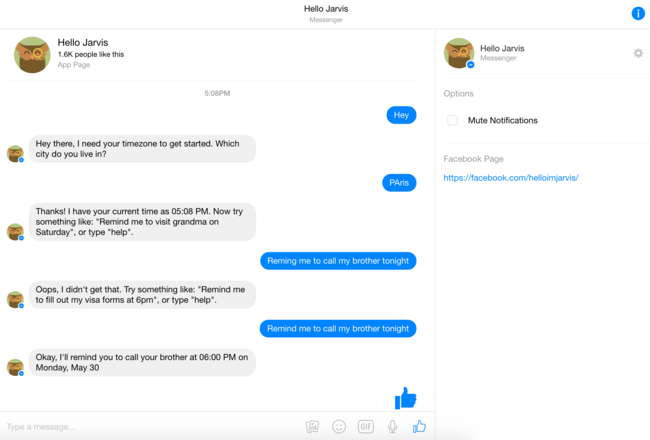

# Jarvis.io : Test (30-05-2016, Anas)

Jarvis est un assistant reminder sur Facebook Messenger.

## TEST

### OB

Très (très) sobre. Jarvis lâche un petit "Hey there" puis enchaîne directement 
sur la question "which city do you live in ?".

>Hey there, I need your timezone to get started. Which city do you live in?

Une fois la ville donnée, il donne un _design-feedback_ important en confirmant 
l'heure actuelle. Puis, il invite à tester avec une requête "copie-collable" et
un "help".

### ENGAGEMENT

Plutôt bien fait. Assez sensible aux fotes d'arutrograf ("reming" ne marche
pas") mais il comprend "next tuesday" 

Le "Help" est un FAQ de CTAs. On peut avoir accès 

Aussi, la commande ne peut marcher qu'avec ses arguments. C'est à dire que 

>Remind me

renvoie le message de fail.

Le message de fail est intéressant : Chaque message contient un exemple, et il 
est toujours différent :) Voici quelques exemples :

>"Remind me to go to the gym at 5pm today"
>"Remind me to take out the trash tomorrow"
>"Remind me to hand in math assignment at 2:55pm"

### JAMMABLE

 - Le Help en CTAs : Pour Facebook Users on pourraît penser à un truc similaire.
 - Feedback (équivalent current time) : L'heure n'étant pas notre requirement, 
on peut récupérer l'école ou la ville de l'utilisateur et répondre une anecdote
à son sujet.
 - On pourraît aussi s'inspirer du random d'exemples. La question à se poser est 
la suivante : Est-ce qu'on a un message qui tombe souvent dans le flow utilisateur ?
Si oui, on peut (si adapté) y caler un exemple. Je propose de mettre des exemples qui
tournent dans les messages de "je ne gère pas".
