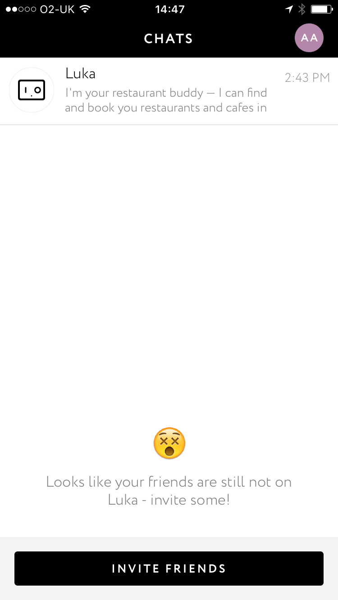

# Luka.ai (iOs, 24/02/2016, Anas)

L'UVP de cet assistant est concentrée sur la recommmandation de bar et de restaurants
Luka est l'un des premiers assistants conversationnels que l'on a repéré chez Jam.

## Premier aperçu

La dernière fois que j'ai testé Luka, j'ai eu la page de conversation dès la première
ouverture de l'application. Cette fois-ci, on me demande de signup!

Après avoir signup, Luka veut avoir avoir accès à mes contacts. Apparemment, c'est 
pour m'aider à organiser des plans avec mes potes. Interesting...

J'invite donc 3 personnes :

Wow. Apparemment ils modifient radicalement leur approche. Après avoir envoyé les invitations (par SMS) j'arrive sur la page suivante : 

On dirait que je peux lancer des conversations avec d'autres utilisateurs. Testons 
avec quelqu'un de la team ! 

Félix (MG dans la conversation) se dévoue pour me faise ses retours :

>Felix : 
> - Signup en phone number assez smart (après réception appstore link)
> - Conversation pas du tout intuitive à priori

Le comportement attendu semble être de parler sur Luka dans le cadre de 
l'organisation d'une sortie/café/diner... Quelques retours en vrac :

 - Plusieurs templates de réponse (pour la même question, il peut répondre 
   de plusieurs manières différentes)
 - Il faut HL Luka pour qu'il réponde : Ca évite de recevoir des messages pour rien
   (parfois il parlait sans qu'on ne mentionne son nom, maybe un fail ?)
 - CTAs pas mis en avant (contrairement à la conversation 1-1)

## Par rapport à Jam

Dans le cadre d'un ["Jam pour conversation de groupe"](https://trello.com/c/g78ezLnF/469-jam-dans-une-conversation-de-groupe), 
on pourraît appliquer la logique de HL pour appeler Jam.
Aussi, le fait d'avoir une multitude de formulations pour une réponse unique
donne un aspect plus humain à Luka.
